# py_amr2fred Package Documentation

A Python library for transforming Abstract Meaning Representation (AMR) into RDF (Resource Description Framework) representations compliant with OWL ontologies. This package provides a comprehensive toolkit for parsing AMR graphs, converting them to semantic RDF knowledge graphs, and enriching them with external knowledge sources.

## Package Overview

The `py_amr2fred` package consists of several interconnected modules that work together to convert AMR representations into RDF knowledge graphs:

### Core Components

- **`amr2fred.py`**: Main orchestrator class that coordinates the entire conversion process
- **`node.py`**: Refactored node system with separated concerns for better maintainability
- **`parser.py`**: AMR string parsing and node tree construction
- **`rdf_writer.py`**: RDF graph generation and serialization
- **`glossary.py`**: Constants, patterns, and configuration management
- **`taf_post_processor.py`**: Post-processing for knowledge enrichment and disambiguation

### Supporting Components

- **`node_core.py`**: Basic node data and identity management
- **`node_relations.py`**: Parent-child relationship management
- **`config_manager.py`**: Configuration and pattern matching
- **`propbank.py`**: PropBank frame and role integration
- **`digraph_writer.py`**: Graph visualization support
- **`uri_builder.py`**: URI construction utilities
- **`couple.py`**: Word occurrence tracking
- **`singleton_mixin.py`**: Singleton pattern implementation
- **`exception_handler.py`**: Error handling and recursion protection

## Class Hierarchy

```mermaid
classDiagram
    %% ================================
    %% DECOUPLED ARCHITECTURE MODULES
    %% ================================
    
    %% ====== AMR2FRED MODULE (Core AMR to FRED transformation) ======
    class Amr2fred {
        +Parser parser
        +RdfWriter writer
        +Glossary glossary
        +TafPostProcessor taf
        +IText2AMR txt2amr
        +translate(amr, text, mode, serialize) str|Graph
        +get_amr(text, alt_api, multilingual) str
    }

    class Parser {
        +List~Node~ nodes
        +List~Couple~ couples
        +ConfigurationManager config
        +Glossary glossary
        +parse(amr_string) Node
        +multi_sentence(root) Node
        +get_parser()$ Parser
    }

    class RdfWriter {
        +Graph graph
        +Graph not_visible_graph
        +NamespaceManager namespace_manager
        +Glossary glossary
        +to_rdf(root_node) void
        +serialize(mode) str
        +new_graph() void
        +get_prefixes() List~str~
    }

    class TafPostProcessor {
        +str framester_sparql
        +str ewiser_wsd_url
        +str usea_preprocessing_url
        +str usea_wsd_url
        +NamespaceManager namespace_manager
        +disambiguate(text, graph) Graph
        +disambiguate_usea(text, graph) Graph
        +link_to_wikidata(graph) Graph
    }

    %% ====== TXT2FRED MODULE (Text to FRED processing pipeline) ======
    class Text2AMR {
        +str spring_uri
        +str spring_uni_uri
        +str usea_uri
        +__init__(txt2amr_uri, m_txt2amr_uri)
        +get_amr(text, alt_api, multilingual) str
    }

    %% ====== ITXT2FRED INTERFACE (API layer for text to FRED operations) ======
    class IText2AMR {
        <<abstract>>
        +__init__(*args, **kwargs)
        +get_amr(text, *args, **kwargs) str
    }

    %% ====== CORE DATA STRUCTURES ======
    class Node {
        +NodeCore core
        +NodeRelations relations
        +str var
        +str relation
        +NodeStatus status
        +bool visibility
        +add_child(child) void
        +get_children() List~Node~
        +find_by_var(var) Node
        +depth_first_search(predicate) Node
        +copy(mode) Node
    }

    class NodeCore {
        +str var
        +str relation
        +int node_id
        +str label
        +str verb
        +NodeStatus status
        +NodeType node_type
        +bool visibility
        +bool prefix
        +bool malformed
    }

    class NodeRelations {
        +List~Node~ node_list
        +Node parent
        +List~Node~ parent_list
        +add_child(child) void
        +remove_child(child) void
        +get_children() List~Node~
        +has_parent() bool
        +is_root() bool
        +is_leaf() bool
    }

    %% ====== CONFIGURATION & GLOSSARY SYSTEM ======
    class Glossary {
        +Dict constants
        +List~str~ NAMESPACE
        +List~str~ PREFIX
        +str FRED_NS
        +str DEFAULT_FRED_NS
        +AMR_* patterns
        +get_constant(key) str
        +load_configuration() void
    }

    class ConfigurationManager {
        +NamespaceManager namespaces
        +AMRPatternMatcher patterns
        +EntityClassifier classifier
        +ValidationService validator
        +get_instance() ConfigurationManager
    }

    %% ====== SUPPORTING COMPONENTS ======
    class DigraphWriter {
        +to_png(graph, not_visible_graph)$ IO
        +to_svg_string(graph, not_visible_graph)$ str
        +create_digraph(root_node)$ str
    }

    class Propbank {
        +Dict frame_data
        +Dict role_data
        +get_frame_info(predicate) Dict
        +get_role_mapping(frame, role) str
        +load_propbank_data() void
    }

    class Couple {
        +int __occurrence
        +str __word
        +get_word() str
        +get_occurrence() int
        +set_occurrence(occurrence) void
        +increment_occurrence() void
        +__str__() str
    }

    %% ====== UTILITY CLASSES ======
    class URIBuilder {
        +ConfigurationManager config
        +build_namespace_uri(prefix, local_name) str
        +resolve_prefixed_uri(prefixed_uri) str
        +build_api_url(endpoint_type, variant, params) str
        +sanitize_local_name(name) str
        +build_instance_uri(prefix, instance_type, identifier) str
        +build_property_uri(prefix, property_name) str
    }

    class SingletonMixin {
        +get_instance() Self
        +_instances Dict
    }

    class RecursionGuard {
        +str context_name
        +int max_depth
        +int depth
        +Dict _counters
        +__enter__() Self
        +__exit__(exc_type, exc_val, exc_tb) None
    }

    %% ====== CONFIGURATION MANAGERS ======
    class NamespaceManager {
        +ConfigurationManager _config_manager
        +Dict _namespaces_config
        +Dict _ontology_config
        +get_namespace(prefix) str
        +get_all_prefixes() Dict
        +get_prefix_list() List~str~
        +get_namespace_list() List~str~
        +resolve_prefixed_name(prefixed_name) str
        +set_namespace(prefix, namespace_uri) void
    }

    class AMRPatternMatcher {
        +ConfigurationManager _config_manager
        +Dict _patterns_config
        +get_pattern(pattern_name) str
        +get_relation(category, relation_name) str
        +get_special_verb(verb_name) str
        +get_fred_mapping(amr_relation) str
        +get_constant(constant_name) Any
    }

    class EntityClassifier {
        +ConfigurationManager _config_manager
        +Dict _entities_config
        +get_entity_types(category) List~str~
        +get_special_entities() List~str~
        +get_quantity_types() List~str~
        +get_date_component(component) str
        +is_named_entity(entity) bool
    }

    class ValidationService {
        +ConfigurationManager _config_manager
        +Dict _validation_config
        +get_data_type_info(data_type) Dict
        +get_serialization_formats() List~str~
        +validate_pattern(value, data_type) bool
    }

    %% ====== METACLASSES & DESCRIPTORS ======
    class GlossaryMeta {
        <<metaclass>>
        +__getattribute__(name) Any
    }

    class classproperty {
        <<descriptor>>
        +func Function
        +__init__(func) void
        +__get__(obj, cls) Any
    }

    %% ====== ENUMS ======
    class RdflibMode {
        <<enumeration>>
        TURTLE
        NT
        XML
        JSON_LD
        N3
    }

    class NodeStatus {
        <<enumeration>>
        OK
        AMR
        ERROR
        REMOVE
    }

    class NodeType {
        <<enumeration>>
        NOUN
        VERB
        OTHER
        AMR2FRED
        FRED
        COMMON
    }

    class CopyMode {
        <<enumeration>>
        SHALLOW
        DEEP
        STRUCTURE_ONLY
        CHILDREN_ONLY
    }

    class LogLevel {
        <<enumeration>>
        DEBUG
        INFO
        WARNING
        ERROR
        CRITICAL
    }

    %% ================================
    %% MODULE RELATIONSHIPS
    %% ================================

    %% Main orchestration - Amr2fred uses all components
    Amr2fred --> Parser : uses
    Amr2fred --> RdfWriter : uses
    Amr2fred --> Glossary : uses
    Amr2fred --> TafPostProcessor : uses
    Amr2fred --> IText2AMR : uses interface

    %% Text2AMR module implements interface
    Text2AMR ..|> IText2AMR : implements
    Amr2fred o-- Text2AMR : composition

    %% Core Node system
    Node --> NodeCore : composition
    Node --> NodeRelations : composition
    NodeRelations o-- Node : manages

    %% Parser creates and manages nodes
    Parser --> Node : creates
    Parser --> Couple : creates
    Parser --> Glossary : uses
    Parser --> ConfigurationManager : uses
    Parser --|> SingletonMixin : inherits
    Parser --> RecursionGuard : uses

    %% RdfWriter processes nodes into RDF
    RdfWriter --> Node : processes
    RdfWriter --> Glossary : uses
    RdfWriter --> NamespaceManager : uses

    %% TafPostProcessor enriches RDF graphs
    TafPostProcessor --> NamespaceManager : uses
    TafPostProcessor --> RecursionGuard : uses

    %% Supporting components
    DigraphWriter --> RecursionGuard : uses
    Propbank --|> SingletonMixin : inherits

    %% Configuration management system
    ConfigurationManager --> NamespaceManager : creates
    ConfigurationManager --> AMRPatternMatcher : creates
    ConfigurationManager --> EntityClassifier : creates
    ConfigurationManager --> ValidationService : creates

    NamespaceManager --> ConfigurationManager : depends on
    AMRPatternMatcher --> ConfigurationManager : depends on
    EntityClassifier --> ConfigurationManager : depends on
    ValidationService --> ConfigurationManager : depends on

    %% Glossary system
    Glossary --> ConfigurationManager : uses
    Glossary --> GlossaryMeta : metaclass
    Glossary --> classproperty : uses

    %% URI Building
    URIBuilder --> ConfigurationManager : uses
    RdfWriter --> URIBuilder : may use

    %% Exception handling
    RecursionGuard --> LogLevel : uses

    %% Enum usage
    Node --> CopyMode : uses
    Node --> NodeStatus : uses
    Node --> NodeType : uses
    Glossary --> RdflibMode : defines
    ConfigurationManager --> RdflibMode : defines
```



## Module Details

### amr2fred.py
The main orchestrator class that coordinates the entire AMR to RDF conversion process.

**Key Features:**
- Integrates parsing, RDF generation, and post-processing
- Supports multiple output formats (serialized strings or RDFLib Graph objects)
- Handles text-to-AMR conversion via external APIs
- Provides multilingual support
- Generates graphical representations

**Usage:**
```python
from py_amr2fred import Amr2fred, Glossary

amr2fred = Amr2fred()
result = amr2fred.translate(
    amr="(w / want-01 :ARG0 (i / i) :ARG1 (g / go-02 :ARG0 i))",
    mode=Glossary.RdflibMode.TURTLE,
    serialize=True
)
```

### node.py
Refactored node system that combines three separate components for better separation of concerns:

**Components:**
- **NodeCore**: Basic node data and identity
- **NodeRelations**: Parent-child relationships
- **Node**: Main interface combining both components

**Key Features:**
- Improved testability and maintainability
- Backward compatibility with original Node API
- Enhanced tree operations and traversal methods
- Multiple copy modes for different use cases
- Recursion protection for deep trees

### parser.py
Singleton class responsible for parsing AMR strings into hierarchical node structures.

**Key Features:**
- AMR string preprocessing and normalization
- Node tree construction with proper relationships
- Multi-sentence AMR handling
- Integration with PropBank for semantic roles
- Error handling and malformed AMR recovery

### rdf_writer.py
Converts node hierarchies into RDF graphs with proper namespace management.

**Key Features:**
- RDFLib Graph construction
- Namespace binding and management
- Multiple serialization formats
- Visibility-based triple filtering
- URI construction and normalization

### glossary.py
Centralized management of constants, patterns, and configuration data.

**Key Features:**
- AMR pattern definitions
- Namespace and prefix management
- Node status and type enumerations
- Singleton pattern with metaclass support
- Configuration loading and validation

### Node System Architecture

The refactored node system provides better separation of concerns:

#### NodeCore (`node_core.py`)
- Manages basic node attributes (var, relation, label, verb)
- Handles node identity with unique ID generation
- Manages node status and type information
- Provides basic attribute getters and setters

#### NodeRelations (`node_relations.py`)
- Manages parent-child relationships
- Handles hierarchical structure operations
- Provides tree traversal capabilities
- Supports both tree and graph structures
- Includes circular reference detection

#### Node (`node.py`)
- Combines NodeCore and NodeRelations
- Provides backward compatibility with original API
- Implements advanced tree operations
- Supports multiple copy strategies
- Includes search and traversal methods

### Configuration Management

The `config_manager.py` module provides centralized configuration:

**Components:**
- **NamespaceManager**: RDF namespace management
- **AMRPatternMatcher**: Pattern matching for AMR constructs
- **EntityClassifier**: Entity type classification
- **ValidationService**: Input validation
- **APIEndpointManager**: External API configuration

### Post-Processing Pipeline

The `taf_post_processor.py` module enriches RDF graphs:

**Features:**
- Word Sense Disambiguation (WSD)
- Wikidata entity linking
- Knowledge graph enrichment
- Multilingual entity resolution

### Visualization Support

The `digraph_writer.py` module generates visual representations:

**Outputs:**
- PNG images (requires Graphviz)
- SVG strings
- DOT format for custom processing

## Usage Patterns

### Basic AMR Processing
```python
from py_amr2fred import Parser, RdfWriter

parser = Parser.get_parser()
writer = RdfWriter()

root_node = parser.parse(amr_string)
writer.to_rdf(root_node)
rdf_graph = writer.graph
```

### Node Tree Manipulation
```python
from py_amr2fred.node import Node, CopyMode

# Create nodes
parent = Node("p", "TOP")
child = Node("c", "ARG0")

# Build relationships
parent.add_child(child)

# Tree operations
deep_copy = parent.copy(CopyMode.DEEP)
found_node = parent.find_by_var("c")
```

### Configuration Access
```python
from py_amr2fred.config_manager import ConfigurationManager

config = ConfigurationManager.get_instance()
patterns = config.patterns
namespaces = config.namespaces
```

## Design Patterns

The package implements several design patterns:

1. **Singleton Pattern**: Used for Parser, Glossary, and ConfigurationManager
2. **Composition Pattern**: Node combines NodeCore and NodeRelations
3. **Strategy Pattern**: Multiple copy modes and serialization formats
4. **Observer Pattern**: Node relationship management
5. **Factory Pattern**: Graph and URI construction

## Error Handling

The package includes comprehensive error handling:

- **Recursion Protection**: Guards against infinite loops in tree operations
- **Malformed AMR Recovery**: Graceful handling of invalid AMR structures
- **API Failure Handling**: Fallback mechanisms for external services
- **Memory Management**: Efficient handling of large knowledge graphs

## Performance Considerations

- **Lazy Loading**: Configuration and resources loaded on demand
- **Caching**: Frequently used patterns and configurations cached
- **Memory Optimization**: Efficient node storage and relationship management
- **Batch Processing**: Support for processing multiple AMR graphs